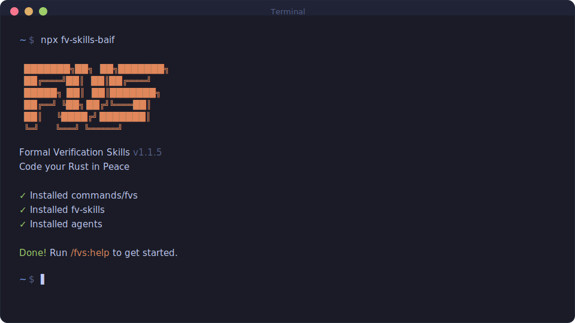

<div align="center">

# FORMAL VERIFICATION SKILLS

**Formal verification of Rust code with AI-assisted specification and proof. Multi-framework, multi-runtime.**

[](https://www.npmjs.com/package/fv-skills-baif)
[](LICENSE)

<br>

```bash
npx fv-skills-baif
```

**Works on Mac, Windows, and Linux. Supports Claude Code, Codex, OpenCode, and Gemini CLI.**

<br>



<br>

</div>

---

## What This Is

FVS encodes the expert formal verification workflow into skills for AI coding assistants. It takes Rust code through a structured pipeline — dependency analysis, deep code understanding, specification generation, and proof — using the AI to handle the tedious parts while you stay in control of the verification strategy.

**v1 focuses on Lean 4 via Aeneas** (Rust → Charon → LLBC → Aeneas → Lean 4). Cross-language porting from Verus, F*, Coq, and Dafny is supported via `/fvs:lean-spec-port` and `/fvs:lean-proof-port`.

Some capabilities are framework-agnostic and work regardless of your verification target:
- **Dependency mapping** builds function call graphs from any extracted code
- **Verification planning** picks optimal targets using greedy graph traversal
- **Natural language explanation** produces human-readable summaries of Rust functions with pre/post conditions

Framework-specific commands (currently Lean) handle the actual specification and proof generation.

---

## Getting Started

```bash
npx fv-skills-baif
```

The installer prompts you to choose:
1. **Runtime** — Claude Code, OpenCode, Gemini, or all
2. **Location** — Global (all projects) or local (current project only)

Verify with `/fvs:help` inside your chosen runtime.

### Prerequisites (Lean 4 / Aeneas)

- A Lean 4 project with `lakefile.toml` and `lean-toolchain`
- Aeneas-generated output (`Types.lean`, `Funs.lean`) from your Rust source
- Lean 4 toolchain installed and working

### Recommended: Lean LSP MCP Server

For enhanced Lean 4 proof development with LLMs, install the [lean-lsp-mcp](https://github.com/oOo0oOo/lean-lsp-mcp) server. It provides instant goal state checking, local lemma search, and proof diagnostics without rebuilding.

**Note:** Avoid using the `lean_multi_attempt` tool for formal verification tasks - FV proof states often explode in size, making multi-attempt testing prohibitively slow.

### Staying Updated

```bash
npx fv-skills-baif@latest
```

<details>
<summary><strong>Non-interactive Install (Docker, CI, Scripts)</strong></summary>

```bash
# Claude Code
npx fv-skills-baif --claude --global   # Install to ~/.claude/
npx fv-skills-baif --claude --local    # Install to ./.claude/

# Codex
npx fv-skills-baif --codex --global    # Install to ~/.codex/

# OpenCode
npx fv-skills-baif --opencode --global # Install to ~/.config/opencode/

# Gemini CLI
npx fv-skills-baif --gemini --global   # Install to ~/.gemini/

# All runtimes
npx fv-skills-baif --all --global      # Install to all directories
```

Use `--global` (`-g`) or `--local` (`-l`) to skip the location prompt.
Use `--claude`, `--codex`, `--opencode`, `--gemini`, or `--all` to skip the runtime prompt.

</details>

---

## Commands

### General (framework-agnostic)

| Command | Description |
|---------|-------------|
| `/fvs:map-code` | Build function dependency graph from extracted code and Rust source |
| `/fvs:plan` | Pick next verification targets via greedy dependency graph traversal |
| `/fvs:natural-language` | Generate natural language explanation of module or function with pre/post conditions |
| `/fvs:help` | Show available FVS commands and usage guide |
| `/fvs:update` | Self-update to latest version via npx |
| `/fvs:reapply-patches` | Reapply local modifications after an FVS update |

### Lean 4 (via Aeneas)

| Command | Description |
|---------|-------------|
| `/fvs:lean-specify` | Generate Lean spec skeleton with `@[progress]` theorem pattern |
| `/fvs:lean-verify` | Attempt proof using domain tactics (progress, simp, ring, omega) |
| `/fvs:lean-refactor` | Refactor, simplify, and decompose verified proofs (dead code removal, simp sharpening, tactic golf) |

### Cross-language Porting

| Command | Description |
|---------|-------------|
| `/fvs:lean-spec-port` | Port specs from other FV languages (Verus, F*, Coq, Dafny) to Lean |
| `/fvs:lean-proof-port` | Port proofs from other FV languages to Lean |

---

## How It Works

FVS follows a five-stage workflow. Each stage builds on the previous.

### 1. Map

`/fvs:map-code` — Analyze extracted code and Rust source to build a function dependency graph. Produces `CODEMAP.md` with every function, its dependencies, and verification status. Works with any extraction pipeline.

### 2. Plan

`/fvs:plan` — Walk the dependency graph bottom-up to find optimal verification targets. Prioritizes leaf functions (no unverified dependencies) using greedy traversal. Performs deep Rust source analysis to reason about pre/post conditions and bounds.

### 3. Specify

`/fvs:lean-specify <function>` — Generate a specification skeleton for the target function. For Lean 4: uses the `@[progress] theorem fn_spec` pattern with preconditions from Rust source analysis and postconditions matching function behavior.

### 4. Verify

`/fvs:lean-verify <function>` — Attempt to prove the specification. For Lean 4: uses domain-specific tactics (`progress`, `simp`, `ring`, `field_simp`, `omega`). Reports proof status and remaining goals if incomplete.

### 5. Simplify

`/fvs:lean-refactor <spec_path>` — Refactor, simplify, and decompose verified proofs. Applies tiered heuristics (dead code removal, simp sharpening, tactic golf, smart automation) while verifying compilation after every change. Three modes: safe, balanced (default), and aggressive.

---

## Uninstalling

```bash
# Global
npx fv-skills-baif --claude --global --uninstall
npx fv-skills-baif --opencode --global --uninstall

# Local (current project)
npx fv-skills-baif --claude --local --uninstall
```

Removes all FVS commands, agents, hooks, and settings entries. Does not affect other installed tools.

---

## Acknowledgments

The architecture and plugin infrastructure of this project is heavily inspired by — and in parts directly adapted from — [Get Shit Done (GSD)](https://github.com/glittercowboy/get-shit-done). Thanks to the GSD maintainers for building such a solid foundation.

---

## License

MIT License. See [LICENSE](LICENSE) for details.
