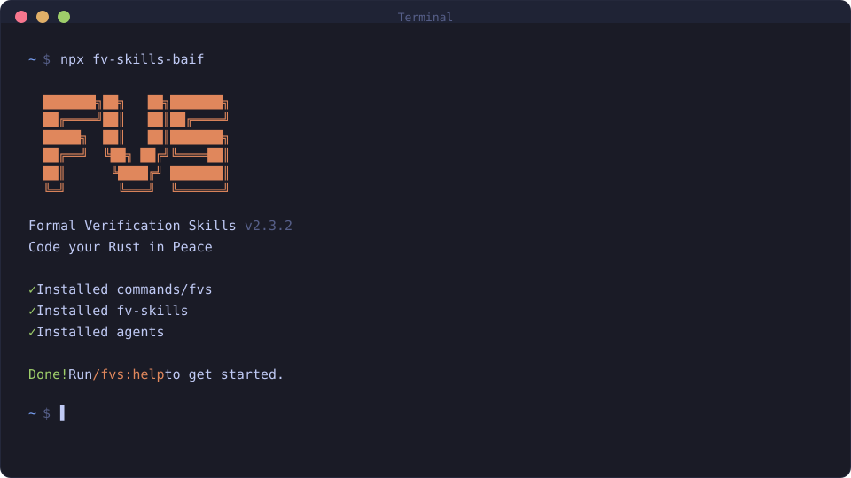

<div align="center">

# FORMAL VERIFICATION SKILLS

**Formal verification in Lean 4 with AI-assisted specification and proof — for Rust code (via Aeneas) and for maths/crypto papers. Multi-runtime.**

[](https://www.npmjs.com/package/fv-skills-baif)
[](LICENSE)

<br>

```bash
npx fv-skills-baif
```

**Works on Mac, Windows, and Linux. Supports Claude Code, Codex, OpenCode, and Gemini CLI.**

<br>



<br>

</div>

---

## What This Is

FVS encodes the expert formal verification workflow into skills for AI coding assistants. It takes Rust code through a structured pipeline — dependency analysis, deep code understanding, specification generation, and proof — using the AI to handle the tedious parts while you stay in control of the verification strategy.

**FVS targets Lean 4** across two tracks. The **functional-correctness track** verifies Rust code via Aeneas (Rust → Charon → LLBC → Aeneas → Lean 4). The **paper track** formalises mathematics and crypto papers directly into Lean — no Rust source or Aeneas extraction required.

Some capabilities are framework-agnostic and work regardless of your verification target:
- **Dependency mapping** builds function call graphs from any extracted code
- **Verification planning** picks optimal targets using greedy graph traversal
- **Natural language explanation** produces human-readable summaries of Rust functions with pre/post conditions

Framework-specific commands (currently Lean) handle the actual specification and proof generation.

---

## Getting Started

```bash
npx fv-skills-baif
```

The installer prompts you to choose:
1. **Runtime** — Claude Code, OpenCode, Gemini, or all
2. **Location** — Global (all projects) or local (current project only)

Verify with `/fvs:help` inside your chosen runtime.

### Prerequisites (Lean 4 / Aeneas)

- A working Lean 4 toolchain, and a Lean project with `lakefile.toml` and `lean-toolchain`
- **Functional-correctness track:** Aeneas-generated Lean (`Types.lean`, `Funs.lean`). Produce it from a Rust crate with `/fvs:aeneas-extract`, or supply the output of an existing Aeneas run.
- **Paper track:** no Rust or Aeneas needed — bring your paper/source material (PDF, LaTeX, images).
- **Optional:** the Codex CLI, to run the crypto loop's thinking stages dual-runtime (`--codex`).

### Recommended: Lean LSP MCP Server

For enhanced Lean 4 proof development with LLMs, install the [lean-lsp-mcp](https://github.com/oOo0oOo/lean-lsp-mcp) server. It provides instant goal state checking, local lemma search, and proof diagnostics without rebuilding.

**Note:** Avoid using the `lean_multi_attempt` tool for formal verification tasks - FV proof states often explode in size, making multi-attempt testing prohibitively slow.

### Staying Updated

```bash
npx fv-skills-baif@latest
```

<details>
<summary><strong>Non-interactive Install (Docker, CI, Scripts)</strong></summary>

```bash
# Claude Code
npx fv-skills-baif --claude --global   # Install to ~/.claude/
npx fv-skills-baif --claude --local    # Install to ./.claude/

# Codex
npx fv-skills-baif --codex --global    # Install to ~/.codex/

# OpenCode
npx fv-skills-baif --opencode --global # Install to ~/.config/opencode/

# Gemini CLI
npx fv-skills-baif --gemini --global   # Install to ~/.gemini/

# All runtimes
npx fv-skills-baif --all --global      # Install to all directories
```

Use `--global` (`-g`) or `--local` (`-l`) to skip the location prompt.
Use `--claude`, `--codex`, `--opencode`, `--gemini`, or `--all` to skip the runtime prompt.

</details>

---

## Commands

Commands are grouped into five bundles. Each bundle has a **router** command that lists its members and forwards to the matched skill (invoke it bare to print the routing table). All member commands are also directly typeable.

### Aeneas — `/fvs:aeneas`

| Command | Description |
|---------|-------------|
| `/fvs:aeneas-extract` | Drive a Rust crate/folder/file through the bounded Aeneas extraction repair loop (pin audit, classify, auto-apply/bisect/gate/escalate, reversible records) |
| `/fvs:sync-aeneas-verif` | Sync Aeneas/Charon upstream docs and reconcile the extraction blocker catalog via two specialised agents |

### Context — `/fvs:context`

| Command | Description |
|---------|-------------|
| `/fvs:map-code` | Build function dependency graph from extracted code and Rust source |

### Formal-Core — `/fvs:fc`

| Command | Description |
|---------|-------------|
| `/fvs:fc-plan` | Pick next verification targets via greedy dependency graph traversal |
| `/fvs:lean-specify` | Generate Lean spec skeleton with `@[step]` theorem pattern |
| `/fvs:lean-verify` | Attempt proof using domain tactics (step, simp, ring, agrind, scalar_tac) |
| `/fvs:natural-language` | Generate natural language explanation of module or function with pre/post conditions |
| `/fvs:lean-refactor` | Refactor, simplify, and decompose verified proofs (dead code removal, simp sharpening, tactic golf) — *also in Formalise* |
| `/fvs:trust-audit` | Build-backed audit of every sorry/axiom affecting a target layer; `#print axioms` classification, fail-if-unjustified gate, dependency-ordered table |

### Formalise (Paper Track) — `/fvs:formalise`

| Command | Description |
|---------|-------------|
| `/fvs:lean-formalise` | Formalise paper/math content into Lean 4 specs and definitions (one-shot) |
| `/fvs:lean-refactor` | Refactor, simplify, and decompose verified proofs — *also in Formal-Core* |
| `/fvs:crypto-plan` | Author the next bounded, runtime-neutral plan for a topic-based crypto formalisation iteration (KB-grounded, cached under `sources/`) |
| `/fvs:crypto-review` | Send an initial or follow-up crypto plan to authenticated Codex for independent, read-only adversarial review before execution |
| `/fvs:crypto-execute` | Run the current iteration's bounded plan under the green-build guard |
| `/fvs:crypto-eval` | Adversarially evaluate the iteration; ends in one of ACCEPT / FOLLOWUP / HUMAN_RULING / BLOCKED |
| `/fvs:crypto-followup` | Convert eval findings into the next follow-up plan; HALTs on HUMAN_RULING |

### Manage — `/fvs:manage`

| Command | Description |
|---------|-------------|
| `/fvs:help` | Show available FVS commands and usage guide |
| `/fvs:update` | Self-update to latest version via npx |
| `/fvs:reapply-patches` | Reapply local modifications after an FVS update |
| `/fvs:kb-setup` | Set up NotebookLM knowledge base integration (venv, auth, config) |

---

## How It Works

### Functional-correctness track (Rust → Lean 4)

This track verifies Rust that Aeneas has lowered to Lean 4. Starting from a Rust crate, `/fvs:aeneas-extract <path>` drives it through the bounded **extraction repair loop** — pin audit → classify → auto-apply / bisect / gate / escalate → reversible records — until you reach a clean build or a documented escalation. It writes reversible source records (`src-modifications.diff` plus a derived `.json`/`.md` and `src-assumptions.md`) at the crate root and never edits generated Lean. Once you have `Types.lean` / `Funs.lean`, the five-stage verification workflow begins:

### 1. Map

`/fvs:map-code` — Analyze extracted code and Rust source to build a function dependency graph. Produces `CODEMAP.md` with every function, its dependencies, and verification status. Works with any extraction pipeline.

### 2. Plan

`/fvs:fc-plan` — Walk the dependency graph bottom-up to find optimal verification targets. Prioritizes leaf functions (no unverified dependencies) using greedy traversal. Performs deep Rust source analysis to reason about pre/post conditions and bounds.

### 3. Specify

`/fvs:lean-specify <function>` — Generate a specification skeleton for the target function. For Lean 4: uses the `@[step] theorem fn_spec` pattern with preconditions from Rust source analysis and postconditions matching function behavior.

### 4. Verify

`/fvs:lean-verify <function>` — Attempt to prove the specification. For Lean 4: uses domain-specific tactics (`step`, `simp`, `ring`, `field_simp`, `omega`). Reports proof status and remaining goals if incomplete.

### 5. Simplify

`/fvs:lean-refactor <spec_path>` — Refactor, simplify, and decompose verified proofs. Applies tiered heuristics (dead code removal, simp sharpening, tactic golf, smart automation) while verifying compilation after every change. Three modes: safe, balanced (default), and aggressive.

### 6. Audit

`/fvs:trust-audit <target>` — Build-backed audit of the trust surface. Runs a green-build precondition, then uses `#print axioms` to classify every in-scope declaration as verified / `sorry` / axiom. The classical trio (`propext`, `Classical.choice`, `Quot.sound`) is auto-noted as Lean/Mathlib-standard; any project-custom axiom must be justified or the gate reports NOT-CLEAN. Produces a re-runnable, dependency-ordered table under `.formalising/audits/`.

### The paper track (maths / crypto)

The paper track formalises papers directly into Lean 4 — no Rust, no Aeneas. Two entry points:

- **One-shot:** `/fvs:lean-formalise` reads your PDFs / images / LaTeX (optionally grounded in a NotebookLM knowledge base via `/fvs:kb-setup`) and produces Lean definition and spec files in a single pass.
- **Iterative crypto loop:** for larger crypto formalisations, a topic-based, restartable loop with
  an independent pre-execution review gate:

  `/fvs:crypto-plan` → `/fvs:crypto-review` → `/fvs:crypto-execute` → `/fvs:crypto-eval` → `/fvs:crypto-followup` → `/fvs:crypto-review` → repeat

  A high-effort thinker authors each bounded plan. Before execution, authenticated Codex
  independently attacks the plan or follow-up under a read-only sandbox and returns an
  evidence-backed APPROVE / APPROVE-WITH-EDITS / REJECT verdict. The executor runs an approved plan
  under a green-build guard; the post-execution adversarial eval tries to refute the spec, proof,
  and assumptions and ends in exactly one of ACCEPT / FOLLOWUP / HUMAN_RULING / BLOCKED. Follow-up
  turns findings into the next plan (halting for a human modeling ruling) and is reviewed again
  before execution.

  **Single- vs dual-runtime (`--codex`).** By default the loop is single-runtime — the thinking stages (`crypto-plan`, `crypto-eval`, `crypto-followup`) run the in-runtime `fvs-crypto-thinker`. Pass `--codex` to hand a stage's thinking to an independent **Codex CLI** thinker instead, so the adversarial planner/evaluator runs on a *different engine* than the executor and blind spots don't correlate. `crypto-execute` is the runtime-neutral executor and takes no `--codex`. Without the Codex CLI installed, a `--codex` stage stops with an install hint rather than silently falling back.

---

## Uninstalling

```bash
# Global
npx fv-skills-baif --claude --global --uninstall
npx fv-skills-baif --opencode --global --uninstall

# Local (current project)
npx fv-skills-baif --claude --local --uninstall
```

Removes all FVS commands, agents, hooks, and settings entries. Does not affect other installed tools.

---

## Acknowledgements

FVS builds on the work of several open-source projects:

- **[Aeneas](https://github.com/AeneasVerif/aeneas)** -- FVS incorporates and adapts
  documentation and proof skills from the Aeneas verification framework (Apache 2.0).
  The upstream Aeneas documentation is stored in `fv-skills/upstream/aeneas/` and can
  be synced with `/fvs:sync-aeneas-verif`.

- **[GSD (Get Shit Done)](https://github.com/gsd-build/get-shit-done)** -- FVS follows
  the GSD plugin architecture for Claude Code skill distribution (MIT).

- **[lean-lsp-mcp](https://github.com/oOo0oOo/lean-lsp-mcp)** -- MCP server for Lean
  LSP integration, referenced in proof workflows (MIT).

---

## License

MIT License. See [LICENSE](LICENSE) for details.
