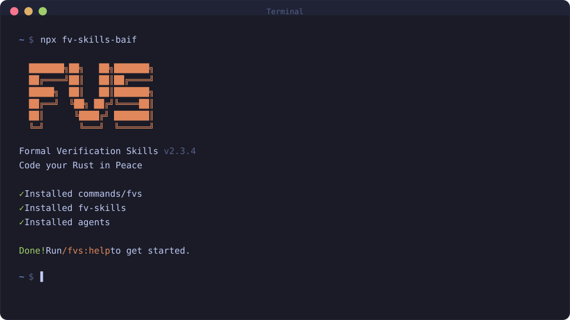

<div align="center">

# FORMAL VERIFICATION SKILLS

**Formal verification in Lean 4 with AI-assisted specification and proof — for Rust code (via Aeneas) and for maths/crypto papers. Multi-runtime.**

[](https://www.npmjs.com/package/fv-skills-baif)
[](LICENSE)

<br>

```bash
npx fv-skills-baif
```

**Works on Mac, Windows, and Linux. Supports Pi, Claude Code, Codex, OpenCode, and Gemini CLI.**

<br>



<br>

</div>

---

## What This Is

FVS encodes the expert formal verification workflow into skills for AI coding assistants. It takes Rust code through a structured pipeline — dependency analysis, deep code understanding, specification generation, and proof — using the AI to handle the tedious parts while you stay in control of the verification strategy.

**FVS targets Lean 4** across two tracks. The **functional-correctness track** verifies Rust code via Aeneas (Rust → Charon → LLBC → Aeneas → Lean 4). The **paper track** formalises mathematics and crypto papers directly into Lean — no Rust source or Aeneas extraction required.

Some capabilities are framework-agnostic and work regardless of your verification target:
- **Dependency mapping** builds function call graphs from any extracted code
- **Verification planning** picks optimal targets using greedy graph traversal
- **Natural language explanation** produces human-readable summaries of Rust functions with pre/post conditions

Framework-specific commands (currently Lean) handle the actual specification and proof generation.

---

## Getting Started

### Pi package

Use the unified installer for an updateable user install or an exact project pin:

```bash
npx fv-skills-baif --pi --global
npx fv-skills-baif --pi --local --pi-version 2.3.4
```

Pi's default scope is user/global. The default `latest` source stays unpinned and follows Pi
package updates. An exact `--pi-version X.Y.Z` source is pinned and is skipped by `pi update`. If
FVS exists in the opposite scope, interactive installs offer keep, move, or cancel; scripts must pass
`--pi-conflict keep|move`. When both remain, Pi's project/local package takes precedence over the
user/global package.

Direct Pi commands remain available:

```bash
pi install npm:fv-skills-baif
pi install npm:fv-skills-baif@2.3.4 --local
pi update npm:fv-skills-baif
pi remove npm:fv-skills-baif
pi remove npm:fv-skills-baif --local
```

To roll back, reinstall the required exact version, for example
`npx fv-skills-baif --pi --global --pi-version 2.3.4`. To remove FVS through the unified installer,
run `npx fv-skills-baif --pi --global --uninstall` or replace `--global` with `--local`.

Start a new session, then run `/skill:fvs-help`. Bundle routers such as `/skill:fvs-fc` and
`/skill:fvs-formalise`, plus member skills such as `/skill:fvs-crypto-plan`, are available directly.

### Plugin marketplace (Claude Code and Codex)

The Beneficial AI Foundation maintains one catalog for FVS and future BAIF plugins. Add the catalog
once, then install FVS from its `beneficial-ai-foundation` marketplace identity:

```bash
# Claude Code
claude plugin marketplace add Beneficial-AI-Foundation/plugins
claude plugin install fvs@beneficial-ai-foundation

# Codex
codex plugin marketplace add Beneficial-AI-Foundation/plugins
codex plugin add fvs@beneficial-ai-foundation
```

Start a new session after installation. Run `/fvs:help` in Claude Code or mention `$fvs:help` in
Codex.

On Codex, the marketplace plugin ships the FVS agent prompts as Markdown but does not register them
as Codex agent roles. When a workflow asks for an FVS specialist that Codex has not registered, FVS
warns you. If the step does not depend on that specialist's settings, FVS runs a generic Codex agent
with the specialist's prompt and labels its output, but Codex then does not guarantee the
specialist's identity, sandbox, model, or reasoning effort. If the step does depend on them, FVS
stops before starting the agent or writing files. A role registered some other way still has its
settings checked at run time.

#### Codex specialist roles

Use one FVS installation per runtime. The npm installer installs a complete, separately managed FVS
for Codex: skills as `$fvs-<name>`, scripts, hooks, a `config.toml` block, and the `fvs-*` agent
roles. To get registered roles today, switch installations rather than adding a second copy:

```bash
codex plugin remove fvs@beneficial-ai-foundation
npx fv-skills-baif --codex --global
```

Adding or updating the marketplace plugin, including with `$fvs:update`, never registers roles or
runs the npm installer.

To refresh an existing install, update the catalog and then update or reinstall FVS:

```bash
# Claude Code
claude plugin marketplace update beneficial-ai-foundation
claude plugin update fvs@beneficial-ai-foundation

# Codex
codex plugin marketplace upgrade beneficial-ai-foundation
codex plugin add fvs@beneficial-ai-foundation
```

The BAIF Git catalog is a versioned distribution source that can list multiple independently
released plugins. It is separate from OpenAI's universal public Plugins Directory, which has its
own per-plugin submission process.

### Unified npm installer

```bash
npx fv-skills-baif
```

The installer prompts you to choose:
1. **Runtime** — Pi, Claude Code, Codex, OpenCode, Gemini, or all
2. **Location** — Global (all projects) or local (current project only)
3. **Pi version** — updateable latest or an exact pinned version

Pi installation delegates to Pi's native package manager; it never copies files into Pi's managed
cache. `--config-dir` continues to apply to supported non-Pi runtimes and is ignored for Pi.
Verify with `/skill:fvs-help` in Pi or `/fvs:help` in the other runtimes.

### Prerequisites (Lean 4 / Aeneas)

- A working Lean 4 toolchain, and a Lean project with `lakefile.toml` and `lean-toolchain`
- **Functional-correctness track:** Aeneas-generated Lean (`Types.lean`, `Funs.lean`). Produce it from a Rust crate with `/fvs:aeneas-extract`, or supply the output of an existing Aeneas run.
- **Paper track:** no Rust or Aeneas needed — bring your paper/source material (PDF, LaTeX, images).
- **Optional:** the Codex CLI, to run the crypto loop's thinking stages dual-runtime (`--codex`).

### Recommended: Lean LSP MCP Server

For enhanced Lean 4 proof development with LLMs, install the [lean-lsp-mcp](https://github.com/oOo0oOo/lean-lsp-mcp) server. It provides instant goal state checking, local lemma search, and proof diagnostics without rebuilding.

**Note:** Avoid using the `lean_multi_attempt` tool for formal verification tasks - FV proof states often explode in size, making multi-attempt testing prohibitively slow.

### Staying Updated

For a marketplace install, invoke `/fvs:update` in Claude Code or `$fvs:update` in Codex. For an npm
install, run:

```bash
npx fv-skills-baif@latest
```

<details>
<summary><strong>Non-interactive Install (Docker, CI, Scripts)</strong></summary>

```bash
# Claude Code
npx fv-skills-baif --claude --global   # Install to ~/.claude/
npx fv-skills-baif --claude --local    # Install to ./.claude/

# Codex
npx fv-skills-baif --codex --global    # Install to ~/.codex/

# OpenCode
npx fv-skills-baif --opencode --global # Install to ~/.config/opencode/

# Gemini CLI
npx fv-skills-baif --gemini --global   # Install to ~/.gemini/

# Pi (latest is updateable; an exact version is pinned)
npx fv-skills-baif --pi --global
npx fv-skills-baif --pi --local --pi-version 2.3.4

# All runtimes (noninteractive use fails before mutation if Pi is unavailable)
npx fv-skills-baif --all --global
```

Use `--global` (`-g`) or `--local` (`-l`) to skip the location prompt.
Use `--pi`, `--claude`, `--codex`, `--opencode`, `--gemini`, or `--all` to skip the runtime prompt.
For an opposite-scope Pi install, scripts must choose `--pi-conflict keep` or
`--pi-conflict move`.

</details>

---

## Commands

Commands are grouped into five bundles. Each bundle has a **router** command that lists its members and forwards to the matched skill (invoke it bare to print the routing table). All member commands are also directly typeable.

### Aeneas — `/fvs:aeneas`

| Command | Description |
|---------|-------------|
| `/fvs:aeneas-extract` | Drive a Rust crate/folder/file through the bounded Aeneas extraction repair loop (pin audit, classify, auto-apply/bisect/gate/escalate, reversible records) |
| `/fvs:model-external` | Model one lockfile/sysroot-grounded external Rust stub and its bounded dependency closure, with reversible writes and separate model/spec reviews |
| `/fvs:sync-aeneas-verif` | Sync Aeneas/Charon upstream docs and reconcile the extraction blocker catalog via two specialised agents |

### Context — `/fvs:context`

| Command | Description |
|---------|-------------|
| `/fvs:map-code` | Build function dependency graph from extracted code and Rust source |

### Formal-Core — `/fvs:fc`

| Command | Description |
|---------|-------------|
| `/fvs:fc-plan` | Pick next verification targets via greedy dependency graph traversal |
| `/fvs:model-external` | Resolve, model, review, prove, build, and trust-audit one external Rust stub plus its bounded external-stub closure |
| `/fvs:lean-specify` | Generate a style-checked Lean spec skeleton with `@[step]` theorem pattern |
| `/fvs:lean-spec-review` | Adversarially review an FC specification with a chosen runtime, model, and effort |
| `/fvs:lean-verify` | Attempt proof with domain tactics while blocking new target-style violations |
| `/fvs:natural-language` | Generate natural language explanation of module or function with pre/post conditions |
| `/fvs:lean-refactor` | Refactor, simplify, and decompose verified proofs (dead code removal, simp sharpening, tactic golf) — *also in Formalise* |
| `/fvs:trust-audit` | Build-backed audit of every sorry/axiom affecting a target layer; `#print axioms` classification, fail-if-unjustified gate, dependency-ordered table |

`lean-specify` and `lean-verify` load a target style guide from
`.formalising/fvs-config.json` (`project.style_guide_path`) or discover standard files such as
`doc/STYLE_GUIDE`. With no guide they enforce a 100-column fallback. Their post-write gate also
rejects ordinary Lean identifiers with three or more namespace dots, steering generated code
toward scoped namespaces, `open`, and local names.

After `lean-specify`, an interactive review menu resolves reviewer, exact catalog model, and
model-supported effort; it never auto-selects a choice. It offers the other runtime first, a fresh
reviewer in the current runtime, or another provider. Other providers use an exported source packet
and imported response. One-run `Skip review` records `Unreviewed (user skipped)` and does not begin
proof work. Reviews and source hashes live under `.formalising/spec-reviews/`.

The reviewer stays read-only and `review.md` stays immutable. The `lean-specify` authoring seat
writes separate `triage.md`. PASS proceeds; APPROVE-WITH-EDITS also proceeds after accepted bounded
edits pass the structure/style/build gates, with no redundant second review. Only REVISE/BLOCKED
starts another fresh review, carrying prior records as untrusted history, with a three-round cap.

Automatic review works even without a config file. To disable the automatic menu, merge this
setting into `.formalising/fvs-config.json` (or create that file with just this object):

```json
{"spec_review": {"automatic": false}}
```

`/fvs:lean-spec-review <spec.lean>` remains available when automation is disabled. No migration or
health command is needed. Missing/authentication failures offer setup and an explicit fallback;
reviewer changes are never silent. A PASS approves the statement for proof work, not the proof.

`lean-specify`, `lean-verify`, and `lean-formalise` share an indexed proof-engineering store at
`.formalising/proof-engineering/`. Commands read `index.md` first, load at most eight relevant
lessons as delimited untrusted reference data, and reconcile at most three evidence-backed
candidates after the run. Every lesson has its own Markdown file under `fc/`, `crypto/`, or
`shared/`, capped at 800 words, so the memory stays searchable and reviewable instead of growing
into one long note.
Legacy `.formalising/PROOF-NOTES.md` content is retained as migration input. The store never keeps
secrets, raw transcripts, ephemeral error dumps, unsupported guesses, or inferred preferences.

```text
.formalising/                # Per-project FVS state
├── CODEMAP.md               # Function inventory and verification status
├── proof-engineering/       # Indexed, durable proof/modeling knowledge
│   ├── index.md             # Read first; links and metadata only
│   └── lessons/
│       ├── fc/              # Functional-correctness lessons
│       ├── crypto/          # Crypto proof and modeling lessons
│       └── shared/          # Lessons validated across tracks
└── fv-plans/                # Formalisation plans and reviews
```

### Formalise (Paper Track) — `/fvs:formalise`

| Command | Description |
|---------|-------------|
| `/fvs:lean-formalise` | Formalise paper/math content into Lean 4 specs and definitions (one-shot) |
| `/fvs:lean-refactor` | Refactor, simplify, and decompose verified proofs — *also in Formal-Core* |
| `/fvs:crypto-plan` | Author the next bounded, runtime-neutral plan for a topic-based crypto formalisation iteration (KB-grounded, cached under `sources/`) |
| `/fvs:crypto-review` | Review a crypto plan with selected Codex, Claude, or Other runtime/model/effort |
| `/fvs:crypto-execute` | Run the current iteration's bounded plan under the green-build guard |
| `/fvs:crypto-eval` | Adversarially evaluate the iteration; ends in one of ACCEPT / FOLLOWUP / HUMAN_RULING / BLOCKED |
| `/fvs:crypto-followup` | Convert eval findings into the next follow-up plan; HALTs on HUMAN_RULING |

### Manage — `/fvs:manage`

| Command | Description |
|---------|-------------|
| `/fvs:help` | Show available FVS commands and usage guide |
| `/fvs:configure` | Configure runtime-aware subagent models, effort levels, and review defaults |
| `/fvs:update` | Update FVS through the current installation channel |
| `/fvs:reapply-patches` | Preserve customizations across FVS updates (patches for npm installs; fork guidance for plugin installs) |
| `/fvs:kb-setup` | Set up NotebookLM knowledge base integration (venv, auth, config) |

`/fvs:configure` stores concrete model IDs under the runtime and exact stage that reported them.
The quality profile is role-aware: authority artifacts use the strongest detected model with max
reasoning, execution/proof filling uses the executor model with xhigh, and research/eval/audit work
uses a smaller model with high. Claude and Codex family preferences never cross runtimes; Pi uses
provider-qualified IDs and keeps its active provider for ordinary work. Each interactive command
shows one model/effort selection manifest with one-run, save, notes, and cancel paths. Missing models
or unsupported efforts require a user choice; unresolved noninteractive runs fail before dispatch.

---

## How It Works

### Functional-correctness track (Rust → Lean 4)

This track verifies Rust that Aeneas has lowered to Lean 4. Starting from a Rust crate, `/fvs:aeneas-extract <path>` drives it through the bounded **extraction repair loop** — pin audit → classify → auto-apply / bisect / gate / escalate → reversible records — until you reach a clean build or a documented escalation. It writes reversible source records (`src-modifications.diff` plus a derived `.json`/`.md` and `src-assumptions.md`) at the crate root and never edits generated Lean. If extraction leaves a required external stub, `/fvs:model-external <stub>` resolves its exact Cargo/vendor/rustc source, journals a reversible hand-written Lean candidate, runs separate model-fidelity and specification reviews, completes proofs, builds, and requires a CLEAN trust audit. Unsafe Rust stops; observable effects require `HUMAN_RULING`. Once required external models are complete, the verification workflow begins:

### 1. Map

`/fvs:map-code` — Run probe-aeneas >= 0.19.0 to build an exact, reproducible function inventory and dependency graph. Models annotate and prioritize the canonical list but never determine its membership or count. Produces `CODEMAP.md` with every in-scope Rust function, its dependencies, and verification status.

### 2. Plan

`/fvs:fc-plan` — Walk the dependency graph bottom-up to find optimal verification targets. Prioritizes leaf functions (no unverified dependencies) using greedy traversal. Performs deep Rust source analysis to reason about pre/post conditions and bounds.

### 3. Specify

`/fvs:lean-specify <function>` — Generate a specification skeleton for the target function. For Lean 4: uses the `@[step] theorem fn_spec` pattern with preconditions from Rust source analysis and postconditions matching function behavior.

The command reads the bounded proof-engineering index and may reviewably add one-file-per-lesson
functional-correctness insights for later sessions.

### 4. Verify

`/fvs:lean-verify <function>` — Attempt to prove the specification. For Lean 4: uses domain-specific tactics (`step`, `simp`, `ring`, `field_simp`, `omega`). Reports proof status and remaining goals if incomplete.

The proof loop loads a bounded selection from `.formalising/proof-engineering/` before research and
can reviewably retain green-build patterns or lessons evidenced by actual Lean diagnostics.

### 5. Simplify

`/fvs:lean-refactor <spec_path>` — Refactor, simplify, and decompose verified proofs. Applies tiered heuristics (dead code removal, simp sharpening, tactic golf, smart automation) while verifying compilation after every change. Three modes: safe, balanced (default), and aggressive.

### 6. Audit

`/fvs:trust-audit <target>` — Build-backed audit of the trust surface. It target-filters the same canonical probe-aeneas inventory, then uses `#print axioms` to classify every supplied function as verified / `sorry` / axiom / uninspectable. The classical trio (`propext`, `Classical.choice`, `Quot.sound`) is auto-noted as Lean/Mathlib-standard; any project-custom axiom, sorry, or uninspectable entry keeps the gate NOT-CLEAN. Produces a re-runnable, dependency-ordered table under `.formalising/audits/`.

### The paper track (maths / crypto)

The paper track formalises papers directly into Lean 4 — no Rust, no Aeneas. Two entry points:

- **One-shot:** `/fvs:lean-formalise` reads your PDFs / images / LaTeX (optionally grounded in a NotebookLM knowledge base via `/fvs:kb-setup`) and produces Lean definition and spec files in a single pass.
- **Iterative crypto loop:** for larger crypto formalisations, a topic-based, restartable loop with
  a fresh pre-execution review gate:

  `/fvs:crypto-plan` → `/fvs:crypto-review` → `/fvs:crypto-execute` → `/fvs:crypto-eval` → `/fvs:crypto-followup` → `/fvs:crypto-review` → repeat

  A high-effort thinker authors each bounded plan. Before execution, a selected Codex, Claude, or
  Other fresh reviewer attacks the plan or follow-up under read-only controls and returns an
  evidence-backed APPROVE / APPROVE-WITH-EDITS / REJECT verdict. The executor runs an approved plan
  under a green-build guard; the post-execution adversarial eval tries to refute the spec, proof,
  and assumptions and ends in exactly one of ACCEPT / FOLLOWUP / HUMAN_RULING / BLOCKED. Follow-up
  turns findings into the next plan (halting for a human modeling ruling) and is reviewed again
  before execution.

  The authoring, execution, eval, and follow-up stages use the lightweight proof-engineering overlay:
  they load at most eight relevant `crypto`/`shared` lessons and propose at most three reviewed
  updates. Modeling lessons require paper or standard citations and remain provisional until an
  accepted adversarial eval or explicit human ruling. The `crypto-review` gate is deliberately
  memory-blind. It labels cross-runtime, same-runtime fresh reviewer, and unverified provenance;
  Other uses packet export/import. APPROVE-WITH-EDITS becomes terminal after the authoring seat
  applies accepted edits and reruns gates, with no second review. REJECT starts a fresh reviewed
  revision with prior history, capped at three reviewer rounds per invocation. Automatic plan and
  follow-up handoff asks reviewer -> model -> effort and never auto-selects. One-run `Skip review`
  records `Unreviewed (user skipped)` and never starts execution. To opt out persistently, merge
  `"crypto_review": {"automatic": false}` into `.formalising/fvs-config.json`; standalone review
  and explicit trusted-path execution remain available without fabricating approval.

  **Single- vs dual-runtime (`--codex`).** By default the loop is single-runtime — the thinking stages (`crypto-plan`, `crypto-eval`, `crypto-followup`) run the in-runtime `fvs-crypto-thinker`. Pass `--codex` to hand a stage's thinking to an independent **Codex CLI** thinker instead, so the adversarial planner/evaluator runs on a *different engine* than the executor and blind spots don't correlate. `crypto-execute` is the runtime-neutral executor and takes no `--codex`. Without the Codex CLI installed, a `--codex` stage stops with an install hint rather than silently falling back.

---

## Uninstalling

```bash
# Global
npx fv-skills-baif --claude --global --uninstall
npx fv-skills-baif --opencode --global --uninstall

# Local (current project)
npx fv-skills-baif --claude --local --uninstall
```

Removes all FVS commands, agents, hooks, and settings entries. Does not affect other installed tools.

---

## Acknowledgements

FVS builds on the work of several open-source projects:

- **[Aeneas](https://github.com/AeneasVerif/aeneas)** -- FVS incorporates and adapts
  documentation and proof skills from the Aeneas verification framework (Apache 2.0).
  The upstream Aeneas documentation is stored in `fv-skills/upstream/aeneas/` and can
  be synced with `/fvs:sync-aeneas-verif`.

- **[GSD (Get Shit Done)](https://github.com/gsd-build/get-shit-done)** -- FVS follows
  the GSD plugin architecture for Claude Code skill distribution (MIT).

- **[lean-lsp-mcp](https://github.com/oOo0oOo/lean-lsp-mcp)** -- MCP server for Lean
  LSP integration, referenced in proof workflows (MIT).

Individual contributions:

- **[Jin Xing Lim](https://github.com/jinxinglim)** -- proposed gating a crypto formalisation
  plan on an independent second-runtime adversarial review before execution, and wrote the
  reviewer prompt that `/fvs:crypto-review` (v2.1.0) is modelled on.

---

## License

MIT License. See [LICENSE](LICENSE) for details.
